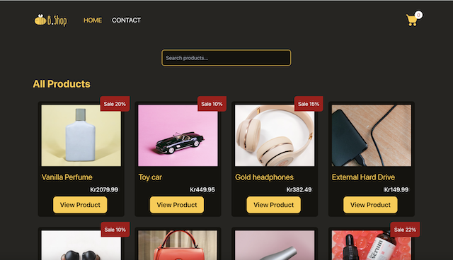

# Bshop - An eCom store


This is a school project to get familiar with React. The site is built with React, Tailwind to create a basic cart function.


## Table of Contents
- [Description](#description)
- [Features](#features)
- [Getting Started](#getting-started)
  - [Prerequisites](#prerequisites)
  - [Installation](#installation)
- [Usage](#usage)
- [Testing](#testing)
- [Built With](#built-with)
- [Contributing](#contributing)
- [Resources](#resources)

## Description
Bshop is an eCom store. This project is to get to know React and starting building from scratch a functional add-to-cart.

## Features
This project has to build:
- Homepage: should have a list of all the products and a look-ahead search bar
- Individual product page: displays data for a single product. There should be an Add to cart button
- Cart page: lists all of the products as well as a total
- Checkout success page: displays a successful checkout message  
- Contact page: contains a contact form with validation

## Getting Started

Brief instructions on how to get a copy of the project up and running on your local machine.

### Prerequisites

Before you start, ensure you have the following installed:

- Web browser (e.g., Chrome, Firefox)
- [Node.js](https://nodejs.org/) (for npm)

### Installation

1. Clone the repository to your local machine and install the dependencies.

   ```bash
   git clone https://github.com/thikimyen-nguyen/js-framework-react

2. Navigate to the project directory:

   ```bash
   cd js-framework-react

3. Install the project dependencies:
   ```bash
    npm install
4. Run the project locally:
    ```bash
    npm start


## Usage

Explore the add-to-cart functionality, check out the responsive design, and interact with the user interface.


## Testing

Testing is an essential part of maintaining code quality and ensuring that the project functions as expected. While this project does not have a dedicated test suite at the moment, we encourage contributors to add tests when making significant changes or additions to the codebase.

### How to Contribute Tests

1. **Fork the Repository**: Start by forking the repository to your GitHub account.

2. **Create a Branch**: Create a new branch for your changes.

   ```bash
   git checkout -b feature/add-tests

3. Write Tests: Develop tests for the new functionality or changes you're introducing. Follow best practices for writing effective tests.

4. Run Tests Locally: Before creating a pull request, make sure to run the tests locally to catch any issues.

   ```bash
   npm test
5. Submit a Pull Request: Once the tests are written and passed locally, submit a pull request.


## Built With

- HTML
- React
- Tailwind
- Hosting services: Netlify
- Design applications: Figma
- Planning applications: GitHub Projects
- Noroff API

## Contributing

Thank you for considering contributing to this project. However, at this time, we are not accepting contributions because this is a school project.


## Resources
Logo was made from https://canva.com